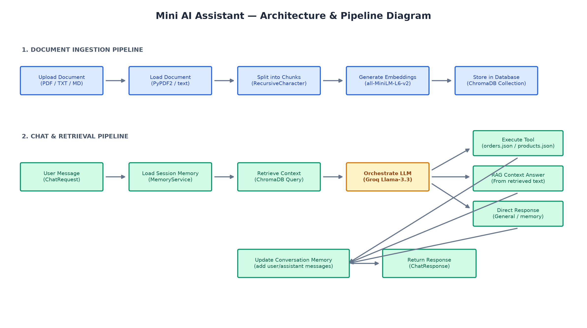

# Mini AI Assistant

A mini AI assistant built with FastAPI that supports knowledge ingestion, RAG-based chat, session context memory, and tool calling.

## Features

- **Knowledge Ingestion** — Upload PDF, TXT, or Markdown files. Documents are chunked, embedded, and stored in ChromaDB for retrieval.
- **RAG Chat** — Ask questions about uploaded documents. Uses semantic search to find relevant context and generates answers via LLM.
- **Context Memory** — Maintains conversation history within a session. The assistant remembers previous messages and resolves references.
- **Tool Calling** — Automatically calls tools (order status lookup, product search) when the user's query matches a tool's purpose.

## Architecture



> See [docs/architecture.md](docs/architecture.md) for a detailed Mermaid version.

## Tech Stack

| Component | Technology | Rationale |
|-----------|-----------|-----------|
| Framework | FastAPI | Required by task; async-first, auto-generated docs |
| LLM | Groq (llama-3.3-70b-versatile) | Fast inference, free tier, strong tool-calling ability |
| Embeddings | sentence-transformers (all-MiniLM-L6-v2) | Local execution — no extra API key, fast, good quality |
| Vector DB | ChromaDB | Zero-config, persistent, pip-installable; simpler than FAISS for this scope |
| Chunking | langchain-text-splitters | Battle-tested `RecursiveCharacterTextSplitter` |

## Setup

### Option 1: Local

```bash
git clone <repo-url>
cd StudioButterfly-Task
python -m venv venv
source venv/bin/activate  # Windows: venv\Scripts\activate
pip install -r requirements.txt
cp .env.example .env      # Edit .env and set GROQ_API_KEY
uvicorn app.main:app --reload
```

### Option 2: Docker

```bash
cp .env.example .env      # Edit .env and set GROQ_API_KEY
docker compose up --build
```

Get a free Groq API key at [console.groq.com](https://console.groq.com).

The API is available at `http://localhost:8000`. Interactive docs at `http://localhost:8000/docs`.

## API Endpoints

| Method | Endpoint | Description |
|--------|----------|-------------|
| `POST` | `/api/v1/ingest` | Upload a document to the knowledge base |
| `POST` | `/api/v1/chat` | Send a message to the assistant |
| `DELETE` | `/api/v1/sessions/{session_id}` | Clear session memory |
| `GET` | `/health` | Health check |

### `POST /api/v1/ingest`

```bash
curl -X POST http://localhost:8000/api/v1/ingest -F "file=@document.pdf"
```

```json
{ "filename": "document.pdf", "chunks": 12 }
```

### `POST /api/v1/chat`

```bash
curl -X POST http://localhost:8000/api/v1/chat \
  -H "Content-Type: application/json" \
  -d '{"session_id": "user1", "message": "What is in the document?"}'
```

```json
{
  "response": "The document covers...",
  "sources": ["document.pdf"],
  "tool_used": null
}
```

## Usage Examples

**Knowledge Q&A:**
```
User: "What are the main topics in the uploaded file?"
→ Retrieves relevant chunks, answers from document content.
```

**Context Memory:**
```
User: "My name is John."
User: "What's my name?"
Assistant: "Your name is John."
```

**Tool Calling:**
```
User: "Where is my order ORD001?"
Assistant: "Your order ORD001 has been shipped, estimated delivery on 2026-07-02."

User: "Do you have a wireless mouse?"
Assistant: "Yes! Wireless Mouse — $25, 12 units in stock."
```

## Running Tests

```bash
pytest tests/ -v
```

## Design Decisions

### Why Groq over OpenAI/Ollama?
Groq provides extremely fast inference (sub-second responses) with a generous free tier. Unlike Ollama, it requires no local GPU or model downloads, making the project easy to set up for reviewers.

### Why ChromaDB over FAISS?
ChromaDB is a higher-level abstraction that handles persistence, metadata filtering, and collection management out of the box. FAISS requires manual serialization, ID management, and metadata tracking. For this scope, ChromaDB reduces boilerplate while providing the same cosine similarity search.

### Why local embeddings (sentence-transformers) instead of API-based?
Using `all-MiniLM-L6-v2` locally means only ONE API key is needed (Groq). The model is small (~80MB), loads in seconds, and produces 384-dimensional embeddings — more than sufficient for document retrieval at this scale.

### Why in-memory session storage?
For a take-home assignment, in-memory `dict[session_id → messages]` is the right trade-off between simplicity and functionality. A production system would use Redis or a database, but that adds infrastructure complexity without demonstrating additional AI pipeline knowledge.

### Tool-Calling Strategy
Rather than using a framework-level tool-calling API (which varies by LLM provider), I use a **prompt-driven approach**: the system prompt defines tool schemas as JSON, and the LLM outputs a structured `{"tool": "name", "args": {...}}` object when appropriate. The application parses this, executes the tool, and sends the result back to the LLM for natural-language formatting. This approach is:
- **Provider-agnostic** — works with any LLM that follows instructions
- **Transparent** — tool call decisions are visible in the response
- **Extensible** — adding a new tool requires only a function + a JSON definition

### Prompt Design
A single system prompt handles all routing with priority rules:
1. **Tools first** — product/order queries always trigger tools, even if document context is available
2. **Knowledge retrieval** — non-tool queries use RAG context
3. **Direct response** — general conversation (greetings, memory recall)
4. **Fallback** — explicit "I couldn't find that information" message

This priority ordering prevents the LLM from "hallucinating" answers from retrieved context when a precise tool lookup is available.

## Pipeline Explanation

### Ingestion Pipeline
1. User uploads a PDF, TXT, or Markdown file via `POST /api/v1/ingest`.
2. The document is loaded (PyPDF2 for PDF, plain read for TXT/MD).
3. Text is split into chunks using `RecursiveCharacterTextSplitter` (500 chars, 50 overlap).
4. Each chunk is embedded using `all-MiniLM-L6-v2`.
5. Embeddings and chunks are stored in ChromaDB with source metadata.

### Retrieval Approach
- The user's query is embedded using the same model.
- ChromaDB performs cosine similarity search, returning the top-3 most relevant chunks.
- Retrieved context is prepended to the user's message before sending to the LLM.

### Memory Implementation
- In-memory dictionary keyed by `session_id`, storing `[{role, content}]` messages.
- Auto-trimmed to the last 20 messages to prevent context overflow.
- Full history is passed to the LLM on each request for continuity.
- Sessions can be explicitly cleared via `DELETE /api/v1/sessions/{id}`.

## Project Structure

```
app/
├── main.py                    # FastAPI app, lifespan, global error handler
├── config.py                  # Settings (pydantic-settings)
├── api/v1/
│   ├── router.py              # V1 router aggregator
│   └── endpoints/
│       ├── ingest.py          # Document upload endpoint
│       └── chat.py            # Chat + session management endpoints
├── schemas/
│   └── chat.py                # Pydantic request/response models
├── services/
│   ├── ingestion.py           # Load → chunk → embed → store
│   ├── retrieval.py           # Vector similarity search
│   ├── llm.py                 # Groq LLM client & orchestration
│   ├── memory.py              # Session conversation memory
│   └── tools.py               # Tool definitions & execution
└── data/
    ├── orders.json            # Sample order data
    └── products.json          # Sample product data
tests/
└── test_services.py           # Unit tests for tools & memory
```

## Error Handling

- **Unsupported file types** → 400 with descriptive message
- **Empty file uploads** → 400 with descriptive message
- **LLM API failures** → Graceful fallback message instead of 500
- **Tool formatting failures** → Returns raw tool result as fallback
- **Order/product not found** → Descriptive "not found" messages
- **Unhandled exceptions** → Global handler returns clean JSON error with logging
