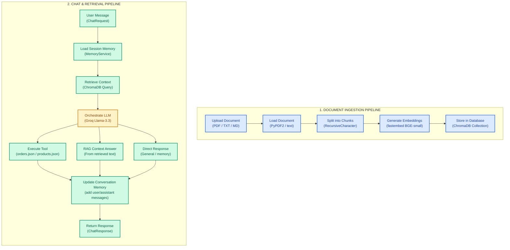

# Architecture & Pipeline Diagram

## AI Pipeline Flow

## Component Overview

| Layer | Component | Responsibility |
|-------|-----------|---------------|
| API | `endpoints/ingest.py` | File upload, validation |
| API | `endpoints/chat.py` | Message handling, orchestration |
| Service | `ingestion.py` | Load → chunk → embed → store |
| Service | `retrieval.py` | Semantic search over ChromaDB |
| Service | `llm.py` | LLM calls, tool call parsing |
| Service | `memory.py` | Session-scoped conversation history |
| Service | `tools.py` | Order status, product search |
| Data | ChromaDB | Vector storage (persistent) |
| Data | `orders.json` / `products.json` | Mock tool data |
